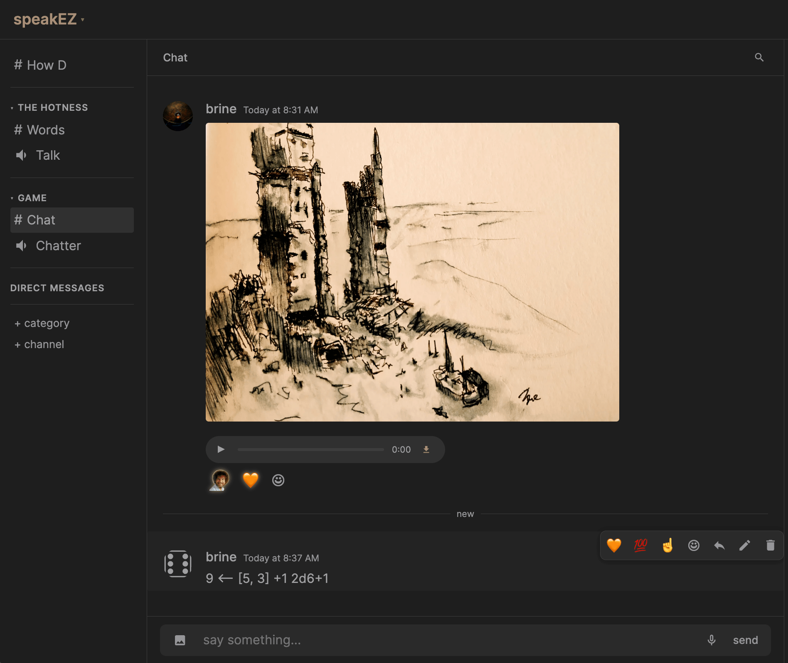

# speakEZ

Group chat that stops at your circle. Invite-only. Not a platform, a sovereign signal. No accounts. No tracking. No one in the middle. 

Text, voice, and video running on Cloudflare's free tier.

## THE PHILOSOPHY

[Dunbar's number](https://en.wikipedia.org/wiki/Dunbar's_number) is the ceiling. Reach is a design smell. The invite _is_ moderation. That and kick.

* **Zero-knowledge Login**: Your passphrase becomes an Ed25519 keypair. The public key is your user ID. Your passphrase is never stored and should never leave your head. Forget it, and you start over.
* **No Paper Trails**: No accounts. No emails. No recovery flows. No biometric scans. Your public key is your identity.
* **Limited Access by Design**: Invites are single-use and expire in 48 hours.
* **No Middlemen**: Chat runs over WebSockets backed by Durable Objects and R2. Voice runs peer-to-peer over WebRTC.
* **Sovereignty over Scalability**


## FEATURES

* **Channels**: Text with markdown, emoji reactions, @mentions, and replies.
* **Voice & Video**: Live voice channels with per-person volume and DSP. Video with grid and full-screen views.
* **Recording**: Hi-fi session recording with one track per person. Built for podcasts and TTRPG actual plays.
* **DMs**: Private messages that persist until the last person leaves.
* **Voice Memos**: Record and share your voice, async.
* **Notifications**: Native push notifications for @mentions.



## STACK

- Cloudflare Workers + Durable Objects + KV + R2
- Ed25519 for identity (passphrase → keypair)
- WebSockets for chat, WebRTC for voice/video
- FTS5 SQLite for message search
- Alarm-based backup to R2

## SETUP

You need a [Cloudflare account](https://cloudflare.com) and [Wrangler](https://developers.cloudflare.com/workers/wrangler/).

```bash
git clone https://github.com/qualityshepherd/speakez
cd speakez
npm install
```

**1. Infrastructure**
> New to Wrangler? Run `npx wrangler login` first to authenticate your account.

Create your KV namespace and R2 buckets:
```bash
npx wrangler kv namespace create KV
npx wrangler r2 bucket create speakez-uploads
npx wrangler r2 bucket create speakez-emoji
```
Paste the KV `id` into your `wrangler.toml`.

**2. Secrets**
Set your admin credentials:
```bash
npx wrangler secret put ADMIN_SECRET
npx wrangler secret put ADMINS
```
`ADMINS` is a comma-separated list of public keys.

**3. Deploy**
```bash
npx wrangler deploy
```

## ACCESS

Generate an invite link by hitting the `/invite` endpoint with your `ADMIN_SECRET`:

`https://yourdomain.workers.dev/invite?secret=ADMIN_SECRET`

Send the link. They set a passphrase. They are in.

## LICENSE

AGPL-3.0-or-later.
